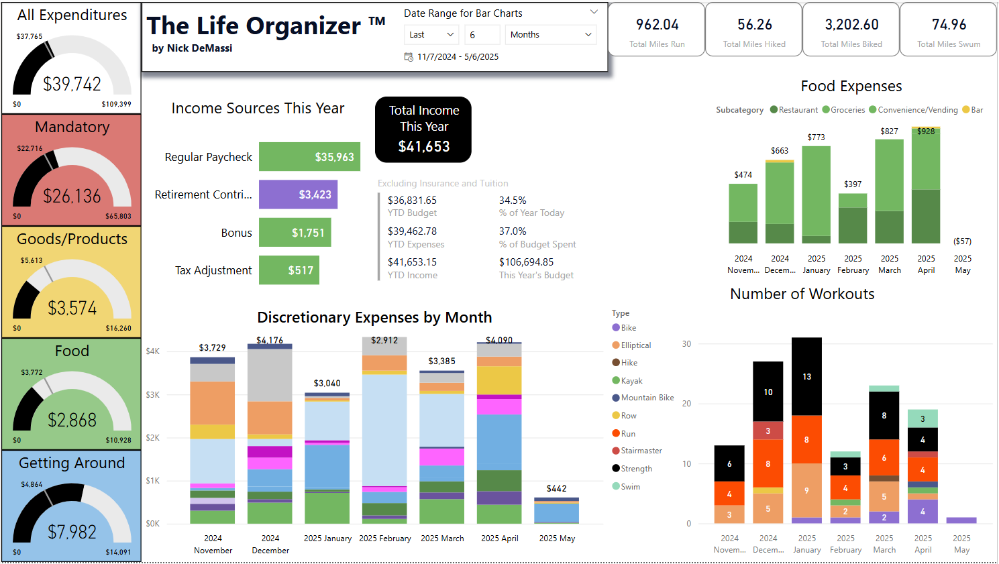

# Life Organizer Repo

## Title
*The Life Organizer* Repository

## Description
This serves as a repository for my Power BI Life Organizer dashboard and associated files.

## Motivation
*The Life Organizer* began as a simple budgeting tool and has evolved into a treasure trove of data and Power BI dashboards covering my finances and fitness habits.

## Features
This project contains interactive dashboards that attempt to answer various questions about my fitness and finances.
I log purchases (with location, categories, and event tags), income (including tax and retirement contribution details), and workouts (using metrics like mileage, weight, duration, etc.).

## Technologies Used
### Power BI Desktop
All of the reports, dashboards, and visualizations were made in **Power BI Desktop** on a **Windows** computer.
### Data Sources
All data is sourced from either **CSV** or **Excel** files, which are stored on SharePoint. I have plans in the future to incorporate weather data via **API**, but have not gotten that far yet.
### Other Languages
**DAX** and **Power Query** (**M Language**) are essential for this project.

## Project Structure
(Overview of files in this project.)

## How to Use
Step-by-step instructions on how to open and explore the Power BI report:
1) Clone the repository
2) Open the .pbix file in Power BI Desktop
3) Interact with the dashboard and customize as needed

## Walkthrough
(Include images, GIFs, or links to videos showing the dashboard interface and key visualizations.)

## Contributing
(Guidelines for others who want to contribute, report issues, or suggest improvements.)

## Contact
You may contact me on LinkedIn at http://www.linkedin.com/in/ndemassi.

## Disclaimer
All data used in this project has purposely and randomly been altered to protect my privacy.
